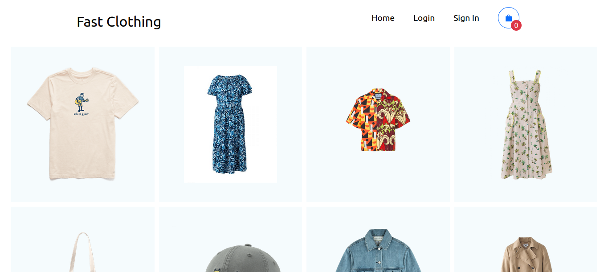

# Fast Clothing 👕
[](https://github.com/FLAIR7/fast-clothing/blob/main/LICENSE.MD)

## About the Project

<a>https://guileless-brigadeiros-07bbc3.netlify.app/</a>
>Fast clothing is a simple E-commerce application built with Spring and React.
I built this application to practice my React and Spring skills. 

## Web

### Home


### Products Cart


## Stack
### :coffee: Back end
- [Java](https://www.oracle.com/br/java)
- [Spring Boot](https://spring.io/projects/spring-boot)
- [Spring Framework](https://spring.io/projects/spring-framework)
- [Spring Security](https://spring.io/projects/spring-security)
- [Spring Data JPA](https://spring.io/projects/spring-data-jpa)
- JPA / Hibernate
- [Maven](https://maven.apache.org/)

### ⚛️ Front end
- [Typescript](https://www.typescriptlang.org/)
- [React](https://pt-br.reactjs.org/)
- CSS
- HTML
- [Bootstrap](https://getbootstrap.com/)

## 👓 Attention
If you find out some bug, feel free to make a pull request or to say more about it on the github issues

## Quick Start 🚀

### :coffee: Back end

Requirement: Java 11

```bash
# clone repo
git clone https://github.com/FLAIR7/fast-clothing.git

# enter in the main folder
cd fast-cloting

# run the project
./mwnw spring-boot:run
```

### ⚛️ Front end

Requirements: npm / yarn

```bash
#clone the repo
git clone https://github.com/FLAIR7/fast-clothing.git

# enter in the frontend folder, inside fast-clothing/src
cd fast-clothing/src/frontend

# install the dependencies
yarn install

# run the project
yarn start

```

## 📝 License

This project is under MIT license.

Vini Sousa

https://www.linkedin.com/in/vinicius-sousa-7630a21a4/

